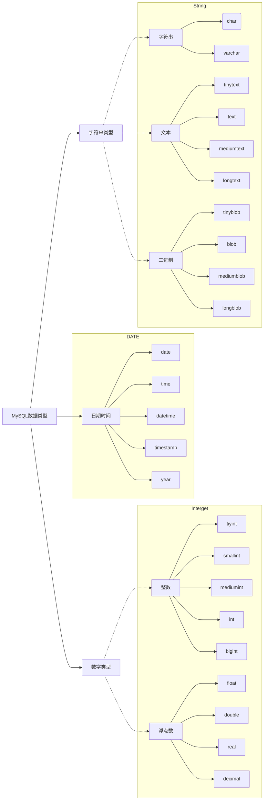

MySQL学习之数据类型

```mermaid
graph LR
	A[MySQL数据类型] --> B[数字类型]
	A[MySQL数据类型] --> C[日期时间]
	A[MySQL数据类型] --> D[字符串类型]
	B[数字类型] -.-> E[整数]
	B[数字类型] -.-> F[浮点数]
	D[字符串类型] -.-> G[字符串]
	D[字符串类型] -.-> H[文本]
	D[字符串类型] -.-> L[二进制]
	subgraph Interget
		E[整数] --> M1[tiyint]
		E[整数] --> M2[smallint]
		E[整数] --> M3[mediumint]
		E[整数] --> M4[int]
		E[整数] --> M5[bigint]
		F[浮点数] --> N1[float]
		F[浮点数] --> N2[double]
		F[浮点数] --> N3[real]
		F[浮点数] --> N4[decimal]
	end
	subgraph DATE
		C[日期时间] --> O1[date]
		C[日期时间] --> O2[time]
		C[日期时间] --> O3[datetime]
		C[日期时间] --> O4[timestamp]
		C[日期时间] --> O5[year]
	end
	subgraph String
		G[字符串] --> P1(char)
		G[字符串] --> P2[varchar]
		H[文本] --> Q1[tinytext]
		H[文本] --> Q2[text]
		H[文本] --> Q3[mediumtext]
		H[文本] --> Q4[longtext]
		L[二进制] --> Z1[tinyblob]
		L[二进制] --> Z2[blob]
		L[二进制] --> Z3[mediumblob]
		L[二进制] --> Z4[longblob]
	end
	
```

