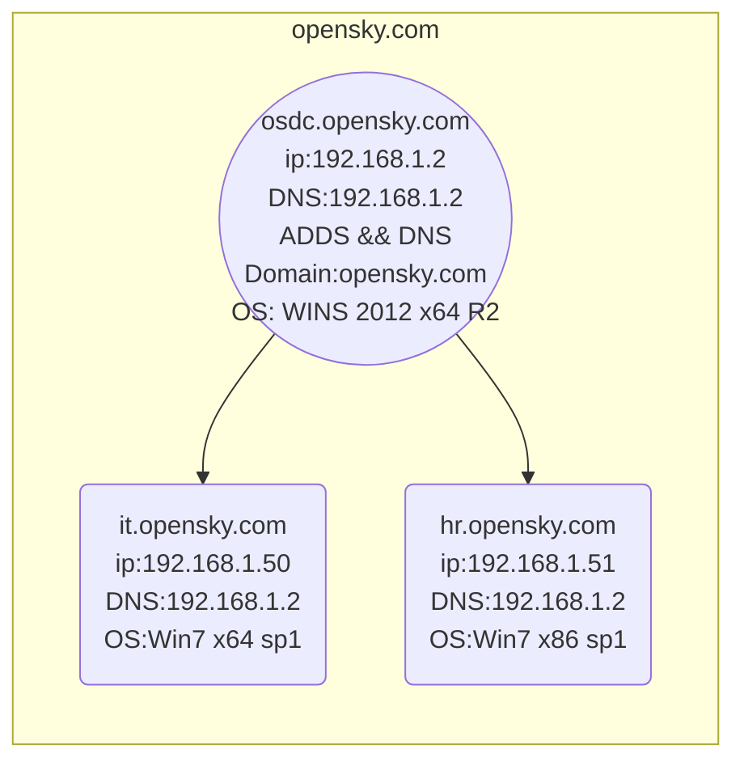
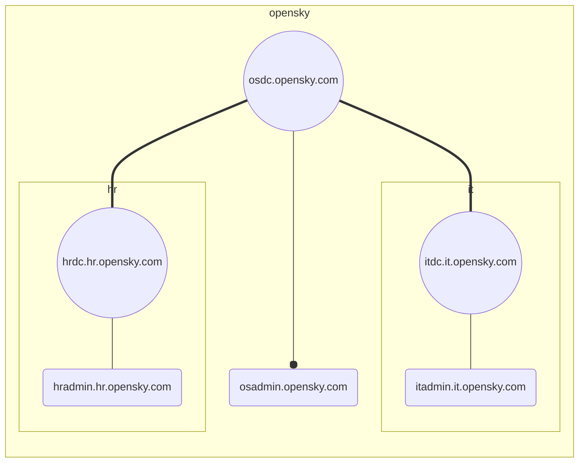

<h1>Windows Server 2012 R2单域及域森林环境搭建</h1>

* TOC
# 1 单域环境搭建

##  1 引    言

​	在进行域环境的配置之前，首先进行域环境的设计，选择域名，确定域控制器（Directory Contoller）所使用的操作系统，需要配置的角色（服务），域内主机以及域控制器所将要使用的IP地址。

- 将要搭建的域环境如图所示

##  2  域控制器环境的搭建

### 2.1 基础配置

​	在进行域控制器以及相关角色的安装之前，需要先行配置三台主机的计算机名，IP地址，以及DNS地址，在这里按下列清单对相应主机进行修改：

|        操作系统        | 主机名 |    IP地址    |     DNS     |
| :--------------------: | :----: | :----------: | :---------: |
| Windows Server 2012 R2 |  osdc  | 192.168.1.2  | 192.168.1.2 |
|   Windows 7 x64 SP1    |   it   | 192.168.1.50 | 192.168.1.2 |
|   Windows 7 x86 SP1    |   hr   | 192.168.1.51 | 192.168.1.2 |

### 2.2  Windows Server 2012 R2安装DNS服务角色

Server Manager --> Add Roles and Features Wizard进入如下界面

next step 选择 Role-based or feature-based installation

Server Selection 中选择安装角色的主机，由于现有域中只有一台主机，所以默认即可

next 选中DNS Server 在弹出的提示框中选择Add Feature 接下来默认即可

当安装进行完毕，可以看到DNS服务的运行标志

出现DNS服务，即为完成安装

### 2.3 域服务安装

接下来安装域服务，此处按照之前进行的设定，使用opensky.com作为域名

Server Manager --> Add Roles and Features Wizard 接下来与DNS服务安装相同，选择Active Directory Domain Serveces即可

### 2.4 提升域服务角色为域控制器（Domain Contrller）

在域服务安装完成后，有如下图所示提示

点击其中 Promote this server to a domain controler （将此服务器提升为域控制器）

在弹出的窗口中选择Add a new forest ， 填写Root domain name为opensky.com之后一路默认即可

安装完成即成功提升为域控制器

### 2.5 将win7主机添加到域中

右键“我的电脑”，点击Properties-->Change settings-->Change

在Domain中添加opensky.com然后默认即可

### 2.6 在域控制器（DC）中创建相应主机的专用用户并将其提升为相应主机的管理员

#### 2.6.1 DC中创建用户

首先，打开 Windows Server 2012 R2 中的 Administrator Tools 中的  Active Directory Users and Computers

在弹出的界面中点击opensky.com域名下的Users，在上面的选项中点击Create a new User in the current container， 出现如下界面，按照相关信息填写即可

#### 2.6.2 使用创建的用户登录域内主机，并提升用户权限为管理员权限

使用创建的用户登录相应主机

如图所示，opensky为主域域名，mdu_win7x64sp1为上一步中创建的用户名

登录成功后，需要提升权限，在DC中新创建的User在域内所有主机都可登录，但是仅拥有用户权限，要创建对应主机的专用账户，需要首先使用创建的User登录目标主机，然后在本机上设置为管理员权限。登录后设置过程如下：

打开Control Panl

点击Change account type 并在出现的界面中，选择对应User，并点击Properties选项，出现下图中右侧界面

选择Administrator， 之后默认即可。

通过以上操作可以建立域内主机的专用账户，该账户虽然可以在域内所有主机（DC除外）登录，但是仅在对应主机上登录时为管理员权限。

# 2 创建子域

### 1 引    言

创建域森林环境时，主要涉及到两步操作，第一步为创建主域，创建主域的过程与创建单域环境的过程完全相同。之所以称呼不同，在于环境建立的目标不同。因此，在本教程中，“创建主域”同“单域环境搭建”二者可互换。

在上一章中，已经介绍了单域环境（即主域）的搭建方法，本章中，介绍子域环境的创建方法。

域森林环境中最简单的模型为一主干一分支结构，但是由于在笔者实践的过程中，发现子域控制器的创建有两种方法，最终的结果有着细微的差别，所以本文中使用一主干两分支的模型搭建域森林环境。

在开始介绍之前，同之前一样，首先给出最终目标的示意图

从上述图片中可以发现，我们仍沿用了在单域环境搭建中使用的opensky.com域名和域内主机osadmin。在此基础上，需要创建两个子域it.opensky.com和hr.opensky.com，在两个子域中各自拥有一个主机，即itadmin和hradmin。

请按下图更改，主机的IP，和相关的计算机名。

PS.下图相关信息是环境搭建完成后的最终结果，如搭建域环境之前，MDC（Master Doamin Controller）的主机名为osdc，主域搭建完成后为osdc.opensky.com。

| 序号 |       虚拟机命名       |        操作系统        |      IP       |      DNS      |         主机名         |      域名      |        本地用户名         |    本地密码    |              角色              |
| :--: | :--------------------: | :--------------------: | :-----------: | :-----------: | :--------------------: | :------------: | :-----------------------: | :------------: | :----------------------------: |
|  1   |  AD5_MDC_WINS12X64R2   | Windows Server 2012 R2 |  192.168.1.2  |  192.168.1.2  |    osdc.opensky.com    |  opensky.com   |       Administrator       | 1qaz2wsx3edc-= | opensky主域控制器 && DNS服务器 |
|  2   | AD5_SDC_IT_WINS12X64R2 | Windows Server 2012 R2 | 192.168.1.102 |  192.168.1.2  |  itdc.it.opensky.com   | it.opensky.com |     it\Administrator      | 1qaz2wsx3edc-= |   it子域控制器 && DNS服务器    |
|  3   | AD5_SDC_HR_WINS12X64R2 | Windows Server 2012 R2 | 192.168.1.202 |  192.168.1.2  |  hrdc.hr.opensky.com   | hr.opensky.com |     hr\Administrator      | 1qaz2wsx3edc-= |   hr子域控制器 && DNS服务器    |
|  4   |   AD5_MDU_WIN7X64SP1   |     Windows 7 x64      | 192.168.1.50  |  192.168.1.2  |  osadmin.opensky.com   |       无       | opensky\mdu_win7x64sp1_en | 1qaz2wsx3edc-= |       opensky主域内主机        |
|  5   | AD5_SDU_IT_WIN7X64SP1  |     Windows 7 x64      | 192.168.1.150 | 192.168.1.102 | itadmin.it.opensky.com |       无       |     it\win7x64sp1_en      | 1qaz2wsx3edc-= |          it子域内主机          |
|  6   | AD5_SDU_HR_WIN7X86SP1  |     Windows 7 x86      | 192.168.1.250 | 192.168.1.202 | hradmin.hr.opensky.com |       无       |     hr\win7x86sp1_en      | 1qaz2wsx3edc-= |          hr子域内主机          |

### 2 创建子域

在前言中提到，子域的创建有两种不同的方式，这两种不同方式的主要区别在于SDC（Sub Domain Controler）所在主机搭建域控制器之前与主域的关系。下面我们分别介绍两种不同的方式。

PS.提示：在搭建子域控制器之前，请确保子域已安装DNS服务，以便于为子域中主机提供DNS服务。

#### 2.1 方式一 ： “分叉”

我们可以将域环境视为一棵树（事实上在微软的官方术语中，也有forest一词）域控制器和域中所有的主机共同构成了树的主干，如果这时候我们将其中一台主机提升为子域控制器，就相当于这棵树长出了一个支干，也就是“分叉”。

这种情况下，安装子域控制器之前，即将要承担SDC角色的主机为主域一员。可以在主域控制器中查询如下：

在这种情况下进行子域控制器的创建，需要使用主域管理员登录该主机。相关过程如下：

首先使用主域管理员账户登录目标主机

打开Server Manager 添加Active Directory Domain Services角色

接下来默认安装即可

安装成功后，点击提升为域控制器（Promote this server to a domain controller）

在出现的部署设置界面中选择 Add a new domain to an existing forest，并填写主域名和将要创建的子域名。

PS.在这里解释一下三个选项

|                     选项                      |             作用             |
| :-------------------------------------------: | :--------------------------: |
| Add a domain controller to an existing forest | 在现有林（域）中添加域控制器 |
|    Add a new domain to an existing forest     |   在现有林（域）中添加子域   |
|               Add a new forest                |         创建林（域）         |

认证完成后按默认设置安装即可，成功后it.opensky.com即创建成功。

#### 2.2 方式二 ： “嫁接”

2.1中已经介绍了“分叉”，这里介绍另一种方式——“嫁接”。我们知道，嫁接的枝条原本与接受嫁接的树没有任何关系，在这里我们面临的是相似的情况。创建子域时，准备承担子域控制器角色的主机与主域并没有任何关系，它既不在主域所有主机的名单里，使用主域管理员账户也无法登录该主机，唯一的联系就是他们存在于同一个网络中。此时我们使用本地主机的管理员账户登录该主机即可。

登录后同样添加角色，在提升为域控制器的操作之前，与方式一均是一样的，唯一的不同在于提升为子域控制器时，使用opensky.com暨主域控制器的管理员进行认证，相关情况如图所示;

认证成功后，默认安装即可。

## 3 总结

经过本次环境搭建，掌握了使用Windows Server 2012 R2搭建与森林哥环境的方法，具体来说介绍了以下几项内容：

- 1.创建DNS服务器

- 2.创建主域（Add a new forest）
  - 2.1安装域服务
  - 2.2提升为域控制器

- 3.创建子域
  - 3.1安装域服务
  - 3.2提升为子域控制器的两种方法（“分叉”，“嫁接”）

- 4.向域中添加主机

- 5.给主机分配专用用户

